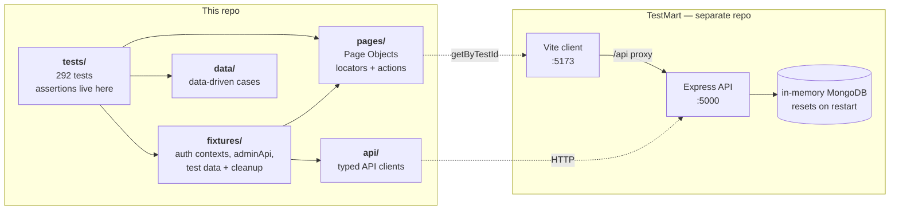
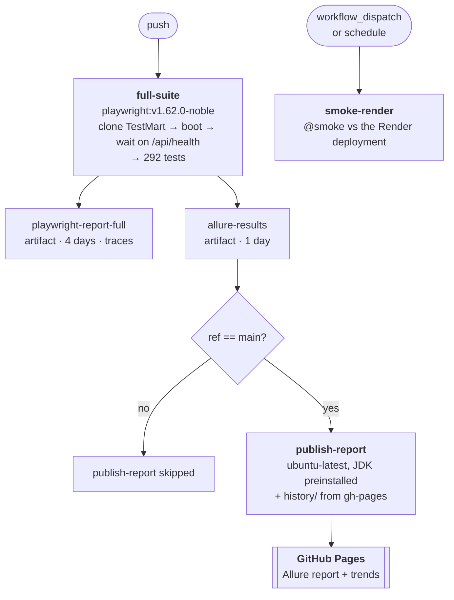

# Playwright Enterprise Framework

[](https://github.com/pulkitMahour/playwright-enterprise-framework/actions/workflows/playwright.yml)

A TypeScript Playwright test framework built the way a product team would build one: page objects,
typed API clients, worker-scoped auth fixtures, data-driven cases, tag-based suite tiers, visual
regression, and CI that boots the application under test from scratch.

**292 tests** across four projects — API, Chromium, Firefox, WebKit.

📊 **[Live Allure report](https://pulkitmahour.github.io/playwright-enterprise-framework/)** — published
from `main` on every push, with pass-rate trends across runs.

---

## The system under test lives in another repo

This repository contains **only the tests**. They run against **TestMart**, a self-contained
e-commerce demo app: **https://github.com/pulkitMahour/testmart**

That separation is deliberate — it is the normal shape of a QA-owned framework, and it forces the
suite to treat the app as a black box reached over HTTP rather than something it can reach into.

There is no `webServer` block in the Playwright config, so **the app must already be running** before
you start a test run.

```bash
git clone https://github.com/pulkitMahour/testmart.git
cd testmart
npm ci && npm ci --prefix server && npm ci --prefix client
npm run dev          # client on :5173, API on :5000 (Vite proxies /api -> :5000)
```

Health check: `curl -s localhost:5000/api/health` → `{"status":"ok","service":"test-mart-api"}`

## Quick start

```bash
git clone https://github.com/pulkitMahour/playwright-enterprise-framework.git
cd playwright-enterprise-framework
npm ci
npx playwright install          # browsers, first time only
cp .env.example .env            # seeded demo credentials — not secrets

npm test                        # all 292 tests
npm run test:smoke              # the 39-test CI gate
```

`baseURL` comes from `BASE_URL` and defaults to `http://localhost:5173`, so the same suite can be
pointed at a deployment without touching a line of test code:

```bash
BASE_URL=https://testmart-gvcc.onrender.com npm run test:smoke
```

## Commands

| Command | What it does |
|---|---|
| `npm test` | All 292 tests, all four projects |
| `npm run test:smoke` | `@smoke` — 39 tests, the CI gate |
| `npm run test:sanity` | `@smoke` + `@sanity` — 140 tests |
| `npm run test:regression` | Everything (same as `npm test`) |
| `npm run test:api` | `--project=api` — 89 tests, no browser launched |
| `npm run test:ui` | `tests/ui` across the three browsers |
| `npm run test:admin` / `test:checkout` | Single area, by tag |
| `npm run test:headed` / `test:debug` | Headed run / Playwright Inspector |
| `npm run test:report` | Open the last Playwright HTML report |
| `npm run test:allure` | Run with the Allure reporter (see [Reports](#reports)) |
| `npm run test:visual` | Visual tests, in Docker (see [Visual testing](#visual-testing)) |
| `npm run typecheck` | `tsc --noEmit` |

## Architecture

Specs sit on top of three layers and hold every assertion. Nothing below the spec layer asserts
anything — that is what keeps specs readable as English.



Four projects. API tests use the `request` fixture and never launch a browser, so running them once
per browser would be pure waste:

| Project | Tests | Notes |
|---|---:|---|
| `api` | 89 | No browser, runs once |
| `chromium` | 71 | Includes the 5 `@visual` tests |
| `firefox` | 66 | `testIgnore: '**/visual/**'` |
| `webkit` | 66 | `testIgnore: '**/visual/**'` |
| **Total** | **292** | `fullyParallel`, 2 workers |

### Project structure

```
.
├── tests/
│   ├── api/                auth · products · orders · users
│   └── ui/                 auth · catalog · cart · checkout · orders · profile · admin · visual
├── pages/                  10 Page Objects
├── api/                    5 API clients
├── fixtures/               4 files
├── data/                   7 files
├── scripts/visual.sh
├── .github/workflows/playwright.yml
└── playwright.config.ts
```

| Directory | Holds | The rule |
|---|---|---|
| `tests/` | The 292 specs, split `api/` and `ui/` | **Every assertion lives here** |
| `pages/` | `BasePage` (nav, search and cart helpers all pages inherit) + one Page Object per route | Locators and actions only — **never an assertion** |
| `api/` | `BaseAPI` (`url()` + the shared request context) + `AuthAPI`, `ProductAPI`, `OrderAPI`, `UserAPI` | Typed wrappers over Playwright's `APIRequestContext` |
| `fixtures/` | `base.fixture` (`TEST_ROLE`, worker-scoped contexts, `adminApi`), `auth.fixture` (`customLogin`, `customRegister`, `freshUserContext`), `api.fixture` (`userRequest` / `adminRequest`), `testData` (provisioning + cleanup) | Set up state and hand it to the test; also re-export `expect` |
| `data/` | `shipping.ts` (free-shipping boundaries and checkout totals as literal expectations), plus `search`, `addresses`, `auth`, `users`, `products`, `types` | Data-driven cases, kept out of the specs |

`auth.fixture` and `api.fixture` both `extend` the `test` from `base.fixture`, so `adminApi` is
defined once and every spec inherits it.

*"Worker-scoped" means the fixture is created once per parallel worker rather than once per test — so
logging in happens a handful of times for the whole run, not 292 times.*

### What a test looks like

Two tests from the login suite. They use the two patterns the whole suite is built from — one starts
from an authenticated session, the other has to run logged out.

```ts
// tests/ui/auth/login.spec.ts
test.describe('Login Page', { tag: ['@auth'] }, () => {

    // customLogin logs in before the body runs, so this starts on a live session
    customLogin('Login test with valid credentials', { tag: '@smoke' }, async ({ page, loginFixture }) => {
        await expect(page).toHaveURL('/');
        await expect(loginFixture.navbar_name).toHaveText('John Doe');
        await expect(loginFixture.nav_admin).toBeHidden();
    });

    // the plain `test` from @playwright/test — this case must run logged out
    test('Login test with invalid credentials', async ({ page }) => {
        const loginPage = new LoginPage(page);
        await loginPage.gotoLoginPage();
        await loginPage.login('invalid@demo.com', 'invalid123');

        await expect(loginPage.loginError).toHaveText('Invalid email or password');
        await expect(page).toHaveURL('/login');
    });
});
```

Four things in there are the whole convention set in miniature:

- **Every `expect` is in the spec.** `LoginPage` supplies `gotoLoginPage()`, `login()` and the
  `loginError` locator — it never asserts anything itself.
- **The fixture replaces setup, not assertions.** `customLogin` handles logging in; the test body is
  only about what should now be true.
- **Tags sit on two levels** — the area (`@auth`) on the describe, the tier (`@smoke`) on the
  individual test. That is what makes `--grep @smoke` a coherent subset.
- **URLs are `baseURL`-relative** (`'/'`, `'/login'`), so the same spec runs against localhost or the
  deployed app with nothing but an env var changed.

## Tags and suite tiers

Two orthogonal axes. **Tier** goes on the test, **area** on the describe.

| Tier | Tests | Command |
|---|---:|---|
| `@smoke` | 39 | `npm run test:smoke` |
| `@smoke` + `@sanity` | 140 | `npm run test:sanity` |
| Full regression | 292 | `npm test` |

Areas: `@api`, `@auth`, `@catalog`, `@cart`, `@checkout`, `@orders`, `@profile`, `@admin`, `@visual`.

There is deliberately **no `@regression` tag**. It would invite `--grep @regression`, which cannot
work for serial blocks whose prerequisites live in the smoke or sanity tier. For the same reason,
**a test that depends on an earlier test in a serial block is never put in a narrower tier than its
prerequisite** — in practice those tests are left untagged, so they only run in the full suite, where
the prerequisite has already run.

## What the tests know about TestMart

A handful of app behaviours shape the whole suite. They are worth knowing before changing anything.

**The in-memory database resets whenever the app server restarts.** Seeded accounts and products
always come back; anything a test creates vanishes on restart and *persists* while the server stays
up. So no test may depend on data created by an earlier test or an earlier run.

**Auth is a JWT in an httpOnly cookie**, not localStorage. The client restores the session by calling
`GET /users/me` on load.

**Seeded accounts** (in `.env.example`, and not secrets):

| Role | Email | Password | `user.name` |
|---|---|---|---|
| Admin | `admin@demo.com` | `admin123` | `Admin User` |
| User | `user@demo.com` | `user123` | `John Doe` |

**Order math — the server is the source of truth.** Tax is 10%; shipping is free only when the
subtotal is *strictly* greater than \$100 (exactly \$100.00 still pays \$10). The server recomputes
totals from the database and decrements stock, so a client cannot override prices.

**Every interactive element has a kebab-case `data-testid`**, so page objects use
`page.getByTestId(...)` throughout. `data-testid="loading"` and `data-testid="empty"` exist as wait
anchors. The app is the source of truth for the inventory:

```bash
grep -rhoE 'data-testid="[^"]+"' path/to/testmart/client/src | sort -u
```

## Conventions

These are the rules that keep the suite readable and repeatable.

- **Page Objects hold locators and actions only. Assertions live in specs.** A spec should read like
  a description of the behaviour.
- **Fixtures set up state and re-export `expect`.** Import the custom `test` variants
  (`customLogin`, `customRegister`) from `fixtures/auth.fixture.ts`; use the plain `test` from
  `@playwright/test` for cases that must run logged out.
- **Navigate and assert with `baseURL`-relative paths** — `page.goto('/login')`,
  `expect(page).toHaveURL('/')`. Never hardcode an origin.
- **Assert persistent state, not transient toasts.** Toasts auto-dismiss, so nav state
  (`nav-username`, `nav-login`) is the primary success signal; toast text is at most secondary.
- **Registration tests use a unique email per run** (`tiger${Date.now()}@demo.com`) so re-runs
  without a server restart do not collide. To test the *duplicate*-email path deterministically,
  register against a **seeded** email — a permanent, guaranteed duplicate.
- **Never place an order against a seeded product.** Ordering decrements `countInStock`, and on a
  persistent database that stock never comes back (the app only seeds an *empty* collection).
  Provision a disposable product with `createProduct(adminApi)` in the describe's `beforeAll` and
  remove it in `afterAll`. Reading prices off seeded products is fine; only *ordering* them is not.
- **Clean up by id — never "delete all".** The suite runs `fullyParallel` with two workers, so a
  blanket delete would destroy data another worker is asserting on. The pattern is a
  `const createdOrders: string[] = []` in the describe, pushed to at creation, and deleted in
  `afterAll`. Describe-level rather than test-level, because serial describes read back what an
  earlier test created.
- **A full run leaves the database as it found it:** users 2, products 16, orders 0. That count is
  the check that cleanup is actually working.

## Reports

Three reporters, each with a job. The config picks them based on environment:

| Where | Reporters |
|---|---|
| Local (default) | `html` |
| Local with `ALLURE=1` | `html` + `allure-playwright` |
| CI | `github` + `html` + `allure-playwright` |

The `github` reporter turns failures into inline annotations on the commit and pull request, instead
of a wall of dots in the log.

### Playwright HTML report

```bash
npm test
npm run test:report
```

This is the **developer-facing** report — it answers *why did this test fail*, and it embeds traces.
In CI it is uploaded as the `playwright-report-full` artifact (4-day retention).

### Allure report

Allure is the **dashboard-facing** report — pass-rate trends across runs, grouping, and history that
the Playwright report does not attempt.

```bash
npm run test:allure      # clean run with the Allure reporter
npm run allure:report    # allure-results/ (raw JSON) -> allure-report/ (static HTML)
npm run allure:open      # serve it; Ctrl+C to stop
```

Two things to know:

- **The reporter is opt-in behind `ALLURE=1`, which `test:allure` sets for you.** Allure never
  cleans its own results directory, so an always-on reporter meant that a `test:smoke` run would
  silently mix into the next report. `test:allure` does the `rm -rf` and sets the flag — it is the
  only entry point you should use.
- **`allure generate` needs a JVM** (`allure-commandline` is Java-based). Run these commands from a
  normal terminal; a snapped terminal emulator may leak an older glibc into the JVM and crash it.

In CI, the Allure report is published to GitHub Pages from `main` and the raw `allure-results` are
kept for a single day as an intermediate. Trends come from carrying the previous report's `history/`
folder forward off the `gh-pages` branch.

### Debugging a failure with the trace viewer

`trace: 'retain-on-failure'` is set, so **every failure ships a full trace** — DOM snapshots, network
log, console, and a frame-by-frame timeline.

```bash
npm run test:report                                   # click the failed test; the trace opens inline
npx playwright show-trace test-results/<dir>/trace.zip # or open one directly
```

For a CI failure, download the `playwright-report-full` artifact from the run — or just drag the
`trace.zip` onto **https://trace.playwright.dev**, which needs nothing installed at all.

## Visual testing

```bash
npm run test:visual              # compare against the committed baselines
npm run test:visual:update       # regenerate them
```

**Baselines are generated inside the CI container image, not on the host.** Screenshot baselines only
match the environment that produced them — fonts and rendering differ between a laptop and a GitHub
runner. So `npm run test:visual` shells out to Docker via `scripts/visual.sh`, and running
`npx playwright test --grep @visual` directly on the host **will** fail. That is expected, not a bug.
Only the `chromium` project has baselines.

Two rules for anything captured:

- **It must be deterministic.** Do not paper over drift by widening `maxDiffPixelRatio` — if a
  screenshot is unstable, the fix is to remove the source of variance.
- The navbar renders the logged-in username, so visual specs register with a **constant name** and a
  unique email. A timestamped name changes the width of every nav link and shifts the whole strip.

## CI

`.github/workflows/playwright.yml` — three jobs.



- **full-suite** runs on every push, in the Playwright container. It clones TestMart, installs three
  `package.json`s, boots the app, waits on `/api/health`, and runs all 292 tests. The mongod binary
  cache is restored *after* `npm ci`, because it lives inside `node_modules`.
- **publish-report** runs on plain `ubuntu-latest` rather than the Playwright container, because
  generating an Allure report needs a JVM and that image has none — while the GitHub runner ships a
  JDK. It is gated on `main`, runs with `always()` so a failing run still publishes its report, and
  skips generation entirely when no test ever reported, so it does not go red for a failure that
  belongs to `full-suite`.
- **smoke-render** is dispatch/schedule only, running `@smoke` against the deployed app. Render's
  free tier spins down, so the job wakes the instance first.

Two details that cost real debugging time and are worth keeping:

- `HOME: /root` on the test step. Container steps run as root while `$HOME` is `/github/home`, owned
  by the image's `pwuser` — and Firefox refuses to launch in that situation.
- Setting up Pages is a one-time manual step: the first run creates the `gh-pages` branch, then
  **Settings → Pages → Source** has to point at it.

## Known gaps

Tracked as issues rather than hidden:
[**open backlog**](https://github.com/pulkitMahour/playwright-enterprise-framework/issues) — order
math duplicated between a page object and an API spec, cleanup helpers that swallow non-2xx
responses, `typecheck` not yet wired into CI, and a host-only run reporting the 5 container-only
visual failures. Planned additions: mobile viewports, accessibility checks, API contract tests,
wider visual coverage, and performance budgets.

There is intentionally no linter or formatter configured; `npm run typecheck` is the only static gate.
